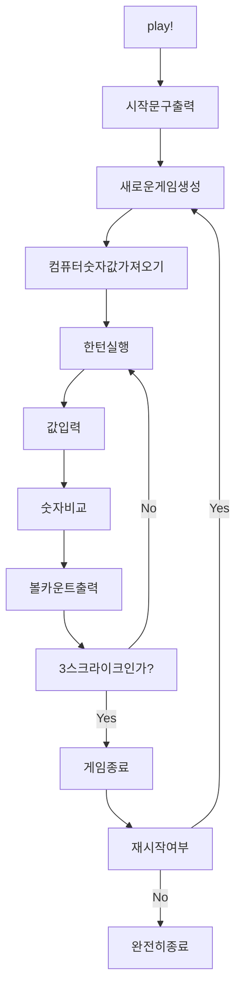

# 숫자 야구 기능 목록

## 기능 목록 요약

- [x] 컴퓨터 숫자값을 위한 함수 구현
  - [x] 리스트에 없는 랜덤한 숫자를 찾는 함수 만들기
  - [x] 리스트에 겹치지 않는 특정 범위의 숫자를 원하는 길이 만큼 받아오는 함수를 완성시키기
  - [x] 테스트 코드 작성 및 정상 동작 확인
- [x] 볼 카운트
  - [x] 볼의 수 세기
  - [x] 스트라이크의 수 세기
  - [x] 볼 카운트 출력하기
  - [x] 테스트 코드 작성 및 정상 동작 확인
- [x] 입력값이 유효한지 판단하기
  - [x] 길이 검사
  - [x] 숫자 여부 검사
  - [x] 입력값에 특정한 값이 포함되지 않았는지 검사
  - [x] 중복 숫자 검사
  - [x] 1 혹은 2인지 검사
  - [x] 테스트 코드 작성 및 정상 동작 확인
- [x] 게임 한턴 실행하기
  - [x] 한턴을 실행할 때 입력되는 값에 대해 유효성 확인하는 함수 만들기
- [x] 새로운 게임 생성하기
- [x] 게임 종료
  - [x] 게임을 종료 여부에 입력되는 값에 대해 유효성 확인하는 함수 만들기
- [x] play 메서드 구현

## 흐름 파악

우선 이번 미션의 기능을 큰 덩어리 별로 나누어 흐름을 파악해보았다.
기능 요구 사항에 맞는 흐름을 파악하기 위해 다음과 같은 부분을 유의했다.

- 게임 시작 문구는 프로그램 실행 시 최초 1회만 출력된다.
  - 재시작했을 경우에는 출력되지 않는다.
- 3스트라이크로 게임이 끝나도 3스트라이크 문구는 출력된다.
- 입력에 대한 예외 처리는 우선 배제하였다.

## 흐름을 바탕으로 기능 분리

흐름에 맞게 기능을 크게 4개로 분리하였다.

- App.play() : 앱을 실행한다.
- 새로운 게임 생성 : 본게임이 시작하고 끝날때까지의 과정이다.
- 게임 한 턴 실행 : 입력을 한 번 하는 것을 한 턴이라고 두고 입력 한 번에 필요한 연산을 진행한다.
- 재시작 여부 판단 : 게임이 끝나면 재시작 여부를 판단해 새로운 게임을 생성하거나 프로그램을 종료시킨다.

## 기능 세분화

크게 분리해 둔 기능을 흐름대로 세분화하였다.

입력값에 대해 예외가 필요한 시점은 사용자가 값을 입력했을 때이므로 이 경우는 예외 처리를 기능으로 추가한다.

- App.play()
  - 시작 문구를 출력한다.
  - 새로운 게임을 생성한다.
- 새로운 게임 생성
  - 컴퓨터의 숫자값을 가져온다.
    - 이 값은 서로 다른 랜덤한 3자리 수이다.
  - 게임을 한턴 실행한다.
- 게임 한턴 실행
  - 숫자를 입력하라는 문구를 띄우고 입력값을 받는다.
    - 입력값이 유효한지 판단한다.
  - 볼 카운트를 센다.
  - 볼 카운트를 출력한다.
  - 볼 카운트의 결과 따라 게임 한 턴을 다시 진행하거나 게임을 종료한다.
- 게임 종료
  - 게임 종료 메시지를 띄운다.
  - 재시작 여부 메시지를 띄우고 입력값을 받는다.
    - 입력값이 유효한지 판단한다.
  - 입력값에 따라 두 가지 분기로 나뉜다.
    - 게임을 재시작한다.(새로운 게임 재생성)
    - 프로그램을 완전히 종료한다.

위의 흐름대로 실행 되기 위해 필요한 기능들을 다시 나열하였다.

- 컴퓨터의 숫자값 가져오기
  - 서로 다른 랜덤한 3자리 수 구하기
- 볼 카운트
  - 볼 카운트 세기
  - 볼 카운트 출력하기
- 입력값이 유효한지 판단
  - 게임 실행 중 입력값
  - 게임 종료 후 입력값

이 기능들이 있어야 위의 흐름대로 프로그램이 동작 할 수 있다. 따라서 위의 기능을 먼저 구현하는 것을 목표로 했다.

### 컴퓨터의 숫자값을 위한 함수 구현

본래는 서로 다른 3자리 수를 구하는 것이지만 확장성을 위해 n자리 수를 가진 값을 구하는 함수로 만든다.

- 반환 형식은 길이가 n인 리스트(배열)로 한다.
- MissionUtils 라이브러리의 `Random.pickNumberInRange()`를 활용한다.

  - 이 함수는 프로퍼티로 두 숫자를 받고 그 두 숫자 사이의 랜덤한 값 하나를 반환한다.

- 리스트에 없는 랜덤한 숫자를 찾는 함수를 만든다.

  - 함수 이름은 getRandomNumberExceptList로 한다.
  - 시작 범위, 끝나는 범위, 리스트를 인자로 받는다.
  - 동작 방식
    - 랜덤한 숫자를 받는다.
      - 리스트에 포함되어 있는 숫자면 함수를 다시 재실행한다.
      - 리스트에 포함되어 있지 않은 숫자면 그 숫자를 반환한다.

- 리스트에 겹치지 않는 특정 범위의 숫자를 원하는 길이 만큼 받아오는 함수를 만든다.
  - 함수 이름은 getUniqueNumbersInRange로 한다.
  - 시작 범위, 끝나는 범위, 원하는 길이를 인자로 받는다.
  - 동작 방식
    - 배열을 선언하고 이 리스트의 길이가 원하는 길이가 될 때까지 getRandomNumberExcepList 함수를 실행시킨 결과 값을 리스트에 push한다.

각 기능에 대해 테스트 코드를 작성해 정상 동작하는지 확인한다.

### 볼 카운트

볼과 스트라이크의 수를 세고 출력한다.

- 볼의 수를 세는 함수를 만든다.

  - 함수 이름은 countBall로 한다.
  - 내 입력값과 컴퓨터의 숫자값을 인자로 받는다.
  - 동작 방식
    - 내 입력값을 하나씩 순회한다.
      - 이 값이 같은 인덱스에 속한 컴퓨터의 값과 달라야 한다.
      - 위의 조건을 만족한다면 컴퓨터의 숫자값이 내 입력값을 포함하는지 확인한다.
      - 조건에 맞으면 볼의 수를 증가시킨다.

- 스트라이크의 수를 세는 함수를 만든다.

  - 함수 이름은 countStrike로 한다.
  - 내 입력값과 컴퓨터의 숫자값을 인자로 받는다.
  - 동작 방식
    - 내 입력값을 순회한다.
      - 이 값이 같은 인덱스에 속한 컴퓨터의 값과 같은지 확인한다.
      - 조건에 맞으면 스트라이크의 수를 증가시킨다.

- 볼 카운트를 출력하는 함수를 만든다.
  - 함수 이름은 countBall로 한다.
  - 볼과 스트라이크의 수를 인자로 받는다.
  - 동작 방식
    - 볼과 스트라이크가 모두 있다면 `~볼 ~스트라이크` 형식의 메시지를 띄운다.
    - 볼만 있다면 `~볼` 형식의 메시지를 띄운다.
    - 스트라이크만 있다면 `~스트라이크` 형식의 메시지를 띄운다.
    - 볼과 스트라이크 둘 다 없다면 `낫싱` 형식의 메시지를 띄운다.

각 기능에 대해 테스트 코드를 작성해 정상 동작하는지 확인한다.

### 입력값이 유효한지 판단하기

사용자가 입력하는 값에 대해 유효한 값인지 검사한다.

유효한 값이 아니면 `throw` 로 예외를 발생시킨다.

- 길이 검사

  - 함수 이름은 checkInputLength로 한다.
  - 입력값과 길이 조건을 인자값으로 받는다.
  - 입력값이 길이 조건과 맞지 않으면 예외를 발생시킨다.

- 숫자인지 검사

  - 함수 이름은 checkInputIsNumber로 한다.
  - 입력값을 인자값으로 받는다.
  - 입력값이 숫자가아니면 예외를 발생시킨다.

- 입력값에 특정한 값이 포함되지 않았는지 검사

  - 함수 이름은 checkInputExcludeCertainNumber로 한다.
  - 입력값과 입력값에 포함되었는지 검사할 특정 숫자를 인자값으로 받는다.
  - 입력값에 인자값으로 전달한 특정 숫자가 포함되어있으면 예외를 발생시킨다.

- 중복숫자가 있는지 검사

  - 함수 이름은 checkInputDuplicateNumber로 한다.
  - 입력값을 인자로 받는다.
  - 입력값에 중복된 숫자가 있으면 예외를 발생시킨다.

- 입력값이 1 혹은 2인지 검사
  - 함수 이름은 checkInputIsOneOrTwo로 한다.
  - 입력값을 인자로 받는다.
  - 입력값이 1혹은 2가 아니라면 예외를 발생시킨다.

각 기능에 대해 테스트 코드를 작성해 정상 동작하는지 확인한다.

### 게임 한 턴 실행하기

게임의 한 턴에 해당하는 과정을 실행시킨다.

- App 클래스에 runTurn 메서드를 만든다.
- 컴퓨터의 숫자값과 사용자 입력값을 인자로 한다.
- 메서드 구성
  - 숫자를 입력하라는 메세지를 띄우고 입력값을 받는다.
  - 사용자 입력값 유효 여부를 판단한다.
  - 사용자 입력값을 쪼개어 배열로 보관한다.
  - 볼 카운트를 진행한다.
  - 볼 카운트 결과를 출력한다.
  - 스트라이크의 수가 3이면 게임을 종료시키고 아니면 한 턴을 다시 실행시킨다.

### 새로운 게임 생성하기

새로운 게임을 생성한다.

- App 클래스에 createNewGame 메서드를 만든다.
- 메서드 구성
  - 컴퓨터의 숫자값을 위해 서로 다른 3자리 숫자를 받아온다.
  - 게임을 실행시킨다.

### 게임 종료

게임이 종료 되었을 때 필요한 동작을 실행시킨다.

- App 클래스에 quitGame 메서드를 추가한다.
- 메서드 구성
  - 게임 종료 메시지를 띄운다.
  - 게임 재시작 여부 메시지를 출력하고 입력값을 받는다.
  - 입력값이 유효한지 검사한다.
  - 입력값에 따라 다음과 같이 나뉜다.
    - 1: 새로운 게임 생성
    - 2: 앱 종료 메시지를 띄운 후 종료

### play 메서드 구현

play 메서드를 완성시킨다.

- 메서드 구성
  - 게임 시작 안내 문구 출력
  - 새로운 게임 생성
