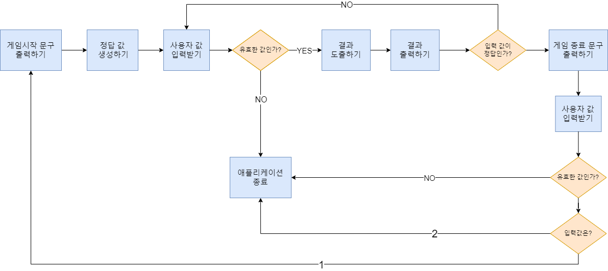

# 프리코스 1주차 -숫자야구-⚾

## 구현 기능 목록🖥
 * [x] **게임 시작 문구 출력하기**   
    * [x] _'숫자 야구 게임을 시작합니다.'_ 출력
 * [x] **게임의 정답이 될 값 생성하기**      
    * [x] [MissionUtils 라이브러리](https://github.com/woowacourse-projects/javascript-mission-utils#mission-utils)의 `Random.pickNumberInRange()` 활용하기  
    * [x] `Set` 객체에 **각각 다른 3가지 수**가 포함될 때까지 생성하기
    * [x] `Set` 객체 배열화 시키기
 * [x] **사용자의 값 입력받기**   
    * [x] _'숫자를 입력해주세요'_ 출력
 * [x] **입력값 유효성 검사하기**      
    * [x] 입력된 값이 **공백**이 아닌가?
    * [x] 입력된 값이 **3글자**인가?
    * [x] 입력된 값이 **1~9 사이의 숫자**만 존재하는가?
    * [x] 입력된 값에 **중복**이 존재하지 않는가?      
 * [x] **유효하지 않은 값일시 `throw`문을 사용해 애플리케이션을 종료**   
 * [x] **유효한 값일시 입력 값의 각 숫자를 배열에 나누어 담기**
 * [x] **결과 도출하기**
    * [x] **동일한 index에 동일한 값**이 존재한다 => 스트라이크 +1
    * [x] **상이한 index에 동일한 값**이 존재한다 => 볼 +1
    * [x] 스트라이크의 값이 **3**이다 => 게임 종료
    * [x] 스트라이크와 볼의 값이 모두** 0**이다 => 낫싱
 * [x] **결과 출력하기** 
    * [x] 출력예시
    > 낫싱 
      1볼 
      1스트라이크 
      1볼 2스트라이크 
      3스트라이크 
    * [x] 결과가 정답과 다를시 _사용자의 값 입력받기_부터 다시 실행
    * [x] 결과가 정답일시 **게임 종료 로직** 실행 
 * [x] **게임 종료하기** 
    * [x] 출력예시
      > 3개의 숫자를 모두 맞히셨습니다! 게임 종료 
            게임을 새로 시작하려면 1, 종료하려면 2를 입력하세요.
    * [x] 사용자의 값 입력받기
    * [x] 입력값 유효성 검사하기
      * [x] 입력된 값이 `1`이나 `2`인가?        
        * [x] 유효하지 않은 값일시 `throw`문을 사용해 애플리케이션을 종료   
    * [x] 입력값이 `1`일시 게임 재시작하기
        * [x] **정답 새로 생성 후 사용자 입력** 받기
    * [x] 입력값이 `2`일시 게임 종료
## 기능 로직🖥

