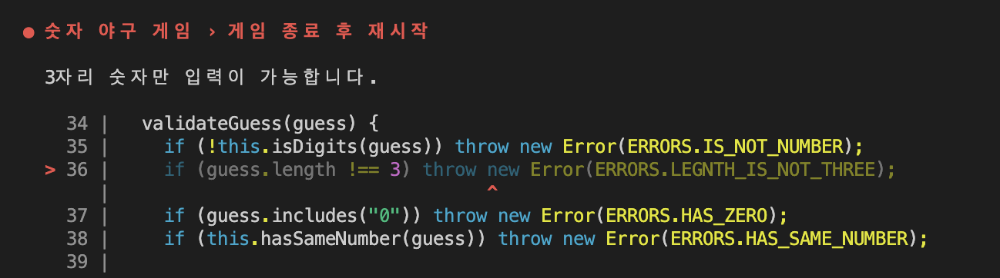

# 기능 목록

에러🤯 -> readline 이 안 닫히는 게 문제로 추정하는데 해결을 못해서 갈아엎음
~~- [x] feat1. 프로그램 첫 작동 시~~
~~- [x] 시작 문구 출력~~
~~ - [x] 1부터 9까지 서로 다른 수로 이루어진 3자리의 수를 결정하고 객체 형태로 저장 {num: idx}: 정답 숫자~~
~~- [x] 사용자에게 인풋 받기~~
~~- [x] feat2. 유효성 검사. 틀리면 프로그램 종료~~
~~- [x] input.length !== 3자리 or 같은 숫자가 있는 수를 입력하면 "1부터 9까지 서로 다른 수로 이루어진 3자리 숫자만 입력 가능합니다."~~
~~- [x] 숫자가 아닌 인풋이 들어온다면, "숫자가 아닌 문자는 입력이 불가능합니다."~~
~~- [x] 0이 포함되었으면 0이 아닌 1부터 9까지 서로 다른 수로 이루어진 3자리 숫자만 입력 가능합니다.~~
~~- [x] feat3. 유효성 검사 통과한 값에 대하여 정답 숫자와 검사~~
~~ - [x] ball, strike 변수 사용~~
~~- [x] for문으로 input 순환. 숫자가 key로 객체에 존재하고, value인 idx 가 같으면 strike++, idx 가 다르면 ball++~~
~~- [x] feat4. input과 정답 숫자를 비교한 결과 출력~~
~~- [x] ball과 strike 가 0이면 볼, 스트라이크 여부 출력 안 함. 둘 다 0일시 낫싱 출력~~
~~- [x] feat5. 3 스트라이크면 해당 게임 종료하고 사용자에게 선택지 제공~~
~~- [x] "게임을 새로 시작하려면 1, 종료하려면 2를 입력하세요." 출력~~
~~- [x] feat6. feat5로 들어온 인풋 유효성 검사~~
~~- [x] 1,2 가 아닌 다른 값이 들어왔다면 예외 발생하고 앱 종료 "옳지 않은 값을 입력하셨습니다.\n프로그램이 종료됩니다"~~
~~ - [x] 1이면 app 재시작~~
~~ - [x] 2면 app 종료~~

- [x] 프로그램 작동 시 시작 문구
- [x] 입력 유효성 검사
- [x] 답안 확인
- [x] replay or end

# 학습

## 무작위로 배열 섞기

```javascript
function shuffle(array) {
  array.sort(() => Math.random() - 0.5);
}

const numbers = [1, 2, 3];
shuffle(numbers);
```

부동 소수점 `Math.random()`
https://7942yongdae.tistory.com/96

## 숫자 유성 검사 정규식

https://stackoverflow.com/questions/9011524/regex-to-check-whether-a-string-contains-only-numbers

## 생각~

- package 파일에 "type": "module" 로 할 것이냐 module.exports로 할 것이냐~~
- src 로 터미널을 열어서 뒷북으로 기능 목록 업데이트 함~~~ㅜㅜ git add 할 때 위치 항상 확인할 것!
- 영어로 커밋 메세지 남기는 건 어렵다.
- 유효성 검사 for 문을 두 번 돌려버리는데 비효율적인 듯 => 리팩토링 요망!
- 함수 쪼개다 보니까 비효율적인 코드가 된 것 같은데 효율 vs 함수?

# 소감과 경험

> 난 무얼 했는가

- 처음에 요구사항을 제대로 읽지 않아서 코드를 갈아엎는 사태가 벌어졌다. 이건 그래도 수습 가능했다. 더하여 에러 발생하면 try catch 로 잡는 습관이 있었는데 이번 과제는 그러지 말아야 했다!!

- 
  test 하는데 발생하는 에러의 원인을 파악하지 못한 점이 너무 아쉽다😂 기한이 지나도 추가적인 리팩토링과 공부는 꼭 해야겠다. 문제 해결보다 test 사용법을 공부하는데 시간을 더 투자했어야 했다. readline 이 닫히지 않아서 생기는 문제라고 생각했는데 예상하지 않는 부분에서도 동일한 문제가 있는 걸 보면 다른 부분이 원인인 것 같다....ㅜㅜ함수를 불러오는 순서? 타이밍 문제가 아닐까 싶다...

- 간단한 로직도 함수명을 보면 바로 이해하기 쉽게 함수로 만드는 걸 선호하는데 별개의 함수로 빼지 않았을 때 테스트를 통과하는 코드가 class 내 함수로 만들면 통과를 못해서 매우 당황했다. 그래도 나만의 공식인 함수 내에 10줄 이하, 들여쓰기 2개 이하는 지킨 점은 만족스러웠다.

- 급한 일이 생겨 온전히 과제에 집중하지 못한 점이 아쉬웠다. 다음 주는 과제도 과제지만 학습에 시간을 많이 투자하고 소감 부분을 꽉꽉 채워보도록 해야겠다.
