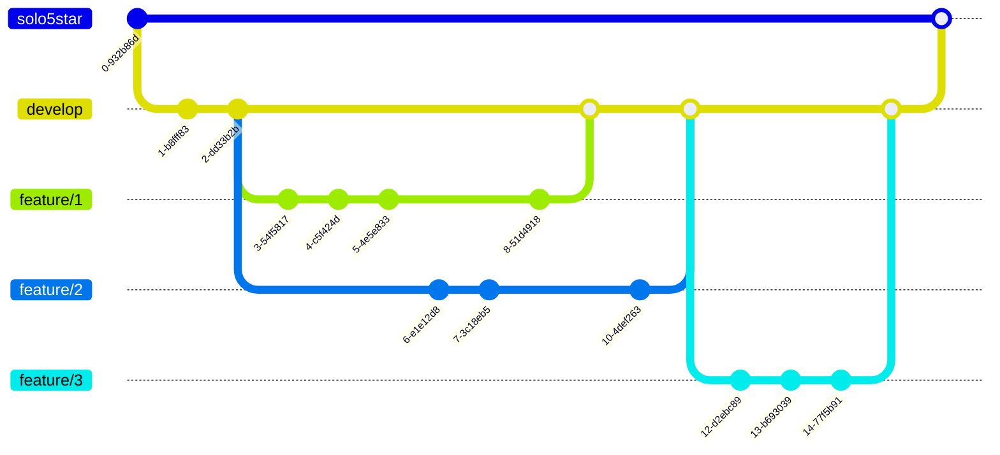

# 구현할 기능 목록

## 기능 목록

* 프로그램 실행 후 초기 화면 (start-phase)
  - `숫자 야구 게임을 시작합니다.` 메세지 출력 후 바로 숫자 야구 게임을 시작한다.

* 숫자 야구 게임 플레이 기능 (play-phase)
  - 상대방(컴퓨터)이 무작위로 서로 다른 3개의 수를 정한다. 
  - `숫자를 입력해주세요 : ` 메세지를 출력하고 사용자 입력을 받는다.
  - 사용자 입력이 서로 다른 3자리의 수가 아닐 경우 예외를 발생시켜 프로그램을 종료한다.
  - 사용자 입력이 주어지면 `볼`, `스트라이크`, `낫싱` 을 판별한 결과를 반환한다.
    > 만약 `볼` 과 `스트라이크` 가 동시에 발생한 경우 `볼` → `스트라이크` 순서로 표시한다.
  - 사용자 입력을 `3스트라이크` 로 판별이 될 때 까지 입력받는다.
  - `3스트라이크` 판별 시 `3개의 숫자를 모두 맞혔습니다! 게임 종료` 메세지를 출력하고 게임을 종료한다.

* 숫자 야구 게임 종료 후 기능 (end-phase)
  - `게임을 새로 시작하려면 1, 종료하려면 2를 입력하세요.` 메세지 출력 후 사용자로 부터 `1` 또는 `2` 의 입력을 받는다.
  - 사용자 입력이 `1` 이면 숫자 야구 게임을 다시 시작한다.
  - 사용자 입력이 `2` 이면 프로그램을 종료한다.

## 프로젝트 환경 및 코드 스타일

* 프로젝트 환경
  - Node.js 14 버전 사용
    > `.nvmrc` 에 명시

* 코드 스타일
  - <details>
    <summary>eslint 사용</summary>

    `npm install --save-dev eslint` 로 설치하고 .eslintrc.js 파일을 생성하여 코드 스타일을 정의한다.

    추가로, `test`, `describe` 와 같은 jest 함수를 인식하지 못하기 때문에 `npm install --save-dev eslint-plugin-jest` 명령으로 eslint 플러그인을 설치한다.

    .eslintrc.js의 `extends: [...]` 에 `'plugin:jest/recommended'` 를 추가한다.
  </details>

  - <details>
    <summary>prettier 사용</summary>

    `npm install --save-dev prettier eslint-config-prettier eslint-plugin-prettier` 로 설치한다.

    > `eslint-config-prettier`: prettier와 겹치는 eslint 룰을 비활성화한다.
    >
    > `eslint-plugin-prettier`: prettier에서 발생한 오류를 eslint 오류로 표시해준다.

    .eslintrc.js의 `extends: [...]` 에 `'plugin:prettier/recommended'` 를 마지막에 추가한다.

    .prettierrc 파일을 생성한 후 prettier 규칙을 추가한다.
  </details>

  - <details>
    <summary>airbnb 규칙 사용</summary>

    `npm install --save-dev eslint-config-airbnb eslint-plugin-import eslint-plugin-react eslint-plugin-react-hooks eslint-plugin-jsx-a11y` 명령으로 설치한다.

    .eslintrc.js의 `extends: [...]` 에 `'airbnb'` 를 추가한다.
  </details>

  - <details>
    <summary>JSDoc 작성</summary>

    클래스, 함수, 변수의 문서화 및 타입을 명확히 하기 위해 JSDoc을 작성한다.

    ```js
    /**
     * 공백을 횟수만큼 늘려주는 함수
     * @param {number} count
     * @returns {string}
     */
    function blank(count) {
      return Array(count).fill(' ').join('');
    }
    ```
  </details>

## 브랜치 전략



<!-- ```
solo5star ___________________________ * _____ ...
      \                              /
develop ______________ * __________ * _______ ...
        \\____________/ \_________//
    feature/{feature-1}  feature/{feature-3}
          \______________________/
             feature/{feature-2}
``` -->

* Git Flow 전략을 기본으로 사용하되 아래의 사항을 지킨다.
* 메인 브랜치는 `solo5star` 이다.
* 기능 그룹 단위 구현을 위한 `feature/{feature}` 브랜치를 만든다.
* 기능 그룹이 완성되면 `develop` 브랜치에 병합한다.
* 애플리케이션이 완성되면 `develop` 브랜치를 메인 브랜치에 병합한다.

## 디렉토리 구조 및 클래스, 함수 목록

```
+ src
  + baseball
    + models
      └ gong.js
        - class Gong
          - #values: [number, number, number]
          - static fromRandom(): Gong
          - valueOf(): [number, number, number]
      └ opponent.js
        - class Opponent
          - #gong: Gong
          - guessGong(gong: Gong): { strike: number, ball: number }
    └ index.js
      - async play(): void
    └ input.js
      - async read(): string
      - write(text: string): void
      - asGong(input: string): Gong
      - asEndSelect(input: string): END_SELECT
    └ constants.js
      - END_SELECT.RETRY = 1
      - END_SELECT.SHUTDOWN = 2
      - MESSAGE.GAME_START = '숫자 야구 게임을 시작합니다.'
      - MESSAGE.INPUT_YOUR_GONG = '숫자를 입력하세요 : '
      - MESSAGE.INVALID_GONG_FORMAT = '서로 다른 3개의 숫자를 입력해야합니다.'
      - MESSAGE.GUESS_GONG_RESULT_BALL = '볼'
      - MESSAGE.GUESS_GONG_RESULT_STRIKE = '스트라이크'
      - MESSAGE.GUESS_GONG_RESULT_NOTHING = '낫싱'
      - MESSAGE.GUESS_GONG_RESULT_SUCCESS = '3개의 숫자를 모두 맞혔습니다! 게임 종료'
      - MESSAGE.END_SELECT = '게임을 새로 시작하려면 1, 종료하려면 2를 입력하세요.'
  └ App.js
```
