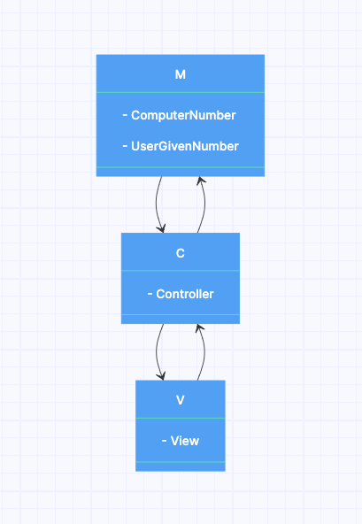

# 🚀 숫자 야구 기능 구현 문서

## 🙋🏻‍♂️작성자

- 이승환(sh981013s)

## 🛠 구조(architecture)

### MVC 구조

### M(Model)

- `상태(state)` 를 다룹니다.

### V(View)

- 화면의 `구성(렌더링)` 을 담당한다.
- 본 미션에서는 따로 화면을 렌더링 하는 미션이 아니였기에, `Console` 을 주로 담당했습니다.

### C(Controller)

- `View` 와 `Model` 사이의 인터페이스 역활을 했으며, 비즈니스 로직을 처리하는 역활을 하였습니다.

## 🧾 구현 기능 목록

### Model 구현

- [x] computerNumber 모델 구현
  - [x] 컴퓨터가 임의로 선택한 3개의 수 생성 구현
  - [x] 상태 관리 로직 구현
- [x] userGivenNumber 모델 구현
  - [x] 유저가 제시한 수 상태 관리 로직 구현
  - [x] 유저가 제시한 수 validation 확인 로직 구현

### View 구현

- [x] 환영 메세지 출력 로직 구현
- [x] 유저 제시 input 받는 로직 구현
- [x] 유저 시도에 따른 결과 출력 로직 구현
- [x] 게임이 끝났을 때 출력하는 로직 구현
- [x] 종료 후 재시도 의사 input 받아 전달하는 로직 구현
- [x] 유저 제시 수 input invalid 할시에 throw error 하는 로직 구현  
- [x] 유저 게임 재시작 의사 input invalid 할시에 throw error 하는 로직 구현

### Controller 구현

- [x] 유저 제시 수 input 받은 후 상태 업데이트 로직 구현
- [x] 유저 제시 수 input 유효한 값인지 검증 로직 구현
- [x] 유저 제시 수 input 에 따른 결과 가공 로직 구현 
- [x] 유저 제시 수 후 게임이 끝났는지 판단 로직 구현
- [x] 게임 종료 후 재시작 여부 input 유효 여부 판단 로직 구현

### Utils 구현

- [x] 유저 input 유효 여부 로직 구현
