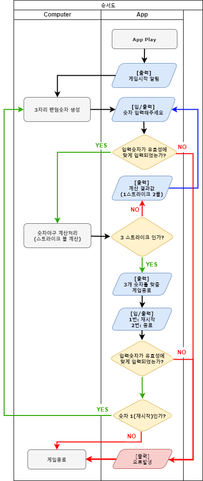

# **🎯 프리코스 2주차 목표**

- **함수를 분리**하고, 각 **작은 단위(함수별)로 테스트를 작성하는 것**에 익숙해지기
- 언어별 테스트 도구를 학습하기
- **학습한 과정** 잘 드러내서 느낀 점을 소감문으로 작성하기

<br/>

---

# **🗂️ 디렉터리 구조 (Directory Structure)**

    📂 docs/ : 전체 문서 모음
    ┗━ 📂 img/ : 문서 이미지 관리
        ┗━🖼️ FlowChart(BaseBall).png : 순서도 이미지 파일
    ┗━ 📑 README.md : 프로그램 기획 및 구성
    📂 __tests__/ : 테스트 관리 폴더
    ┣━ 📑 ApplicationTest.js : 애플리케이션 전체 테스트 파일
    ┣━ 📑 FeatureUnitTest.js : 기능 단위 테스트 파일
    ┗━ 📑 StringTest.js : 문자열 테스트 파일 (Jest 기본 사용법 테스트)
    📂 src/ : 소스파일 폴더
    ┣━ 📂 constants : 상수 관리 폴더
        ┣━ 📑 gameMessage.js : 게임 메세지 관리 파일
        ┗━ 📑 gameSetting.js : 게임 상수 관리 파일
    ┣━ 📂 util : 유틸 관리 폴더
        ┣━ 📑 gameProcess.js : 게임 프로세스에 필요한 유틸 관리 파일
        ┗━ 📑 validation.js : 유효성 검사 유틸 관리 파일
    ┣━ 📑 App.js : 인터페이스 관리 및 유저 입/출력 관리 파일
    ┗━ 📑 Computer.js : 랜덤숫자 생성 및 숫자야구 계산 처리 파일

---

# **💡 git commit 메세지 컨벤션**

- **🗒️ message(메세지) 구조**

  ```
  feat(changelog): 추가 로그인 함수

  로그인 API 개발

  Resolves: #123
  Ref: #456
  Related to: #48, #45
  ```

  - 커밋 메시지의 각 line(라인)은 **최대 100글자**가 넘지 않도록 합니다.

    - 이를 통해 github 및 다양한 git 도구에서 메시지를 더 쉽게 읽을 수 있습니다.

    </br>

  - 🎯 **Subject line (제목 줄)** : Subject line 에는 변경 사항에 대한 간결한 설명이 포함됩니다.

    ```js
    // Subject line구조
    <type>(<scope>): <subject>
    ```

    - **🔖 type (타입)**
      - 어떤 의도로 커밋했는지를 type에 명시한다.
      - 타입은 영어로 작성한다.
    - **🔭 scope (스코프)**
      - 어디가 변경되었는지, 변경된 위치를 입력한다.
      - 함수가 변경되었으면 함수 이름, 메소드가 추가되었으면 class 이름 표기한다.
      - `scope`는 생략 가능하다.
      - 예) `$location`, `$browser`, `$compile`, `$rootScope`, `ngHref`, `ngClick`, `ngView` 등등...
    - **🎯 subject (제목)**
      - 명령문, 현재 시제로 작성한다.
        - 영문 예시) `change` : O / `changed`, `changes` : X
      - 첫글자를 대문자로 쓰지 않아야 한다. 소문자로 써야한다.
      - 마지막에 마침표(.)를 붙이지 말아야한다.

    </br>

  - 📃 **Message Body (메시지 내용)**
    - 명령문, 현재 시제로 작성하길 권장한다.
    - 변경한 이유 및 변경 전과 후의 차이점을 기재한다.
    - 긴 설명이 필요한 경우에 작성한다.
    - 어떻게 했는지보다는, 무엇을 왜 했는지를 작성한다.

  </br>

  - 🦶 **Message Footer (메시지 하단)**
    - 주요 변경 내역들 (Breaking Changes)
      - 모든 주요 변경 내역들은 다음과 함께 하단에 언급되어야 한다.
    - 모든 주요 변경 내역들은 다음과 함께 하단에 언급되어야 한다.
      - 변경점 (description of the change)
      - 변경 사유 (justification)
      - 마이그레이션 지시 (migration instructions)
    - 해결된 이슈 (Referencing Issues)
      - 해결된 이슈는 커밋 메시지 하단에 Closes #<이슈번호> 와 같이 기록되어야 한다.
      - 해결된 이슈가 여러개인 경우는 ,(쉼표) 로 구분해서 기록한다.
      ```js
      // 예시
      Closes #234
      Closes #123, #245, #992
      ```

  </br>

- **🔖 type (타입) 의 종류 :**

  - ✨ feat : 새로운 기능을 추가할 경우
  - 🐛 fix : 버그를 고친 경우
  - 📝 docs : 문서를 수정한 경우
  - 🎨 style : 코드 포맷 변경, 세미 콜론 누락, 코드 수정이 없는 경우
  - ♻️ refactor : 프로덕션 코드 리팩토링
  - ✅ test: 테스트 추가, 테스트 리팩토링 (코드 변경 X)
  - 📦 chore : 빌드 태스트 업데이트, 패키지 매니저를 설정하는 경우 (코드 변경 X)

    <br/>

  - 💄 design : CSS 등 사용자 UI 디자인 변경
  - 💡 comment : 필요한 주석 추가 및 변경
  - 🚚 rename : 파일 혹은 폴더명을 수정하는 경우
  - 🔥 remove : 사용하지 않는 파일 혹은 폴더를 삭제하는 경우

<br/>

---

# **🛠️ 프로그래밍 요구 조건 정리**

## **⭐ 주요 요구 조건**

- #### ⭐ 프로그램 **실행의 시작점**은 `App.js`의 `play` 메서드이다.
- #### ⭐ **Airbnb 자바스크립트** 스타일 가이드🎨 기준으로 작성한다.
- #### ⭐ **Random 값 추출**은 MissionUtils 라이브러리📕의 `Random.pickNumberInRange()`를 활용한다.
- #### ⭐ **MissionUtils 라이브러리📕**에서 제공하는 `Random` 및 `Console API`를 사용하여 구현해야 한다.
- #### ⭐ **사용자의 값을 입력 받고 출력**하기 위해서는 **MissionUtils 라이브러리📕**에서 제공하는 `Console.readLine`, `Console.print`를 활용한다.
- #### ⭐ 기능을 구현하기 전 `docs/README.md`에 **구현할 기능 목록📋**을 정리해 추가한다.
- #### ⭐ **Git의 커밋 단위🧩**는 앞 단계에서 `docs/README.md`에 정리한 **기능 목록 단위📎**로 추가한다.
- #### ⭐ **Jest를 이용**하여 **정리한 기능 목록**이 정상 동작함을 **테스트 코드로 확인**한다.
<br/>

## **📌 기타 요구 조건**

- #### **기능을 구현하기 전**에 **기능 목록📋** 을 만든다.
- #### **기능 단위📎** 로 커밋 하는 방식으로 진행한다.
- #### **Node.js 14 버전⚡**에서 실행 가능해야 한다.
- #### 프로그램 구현이 완료되면 `ApplicationTest`의 **모든 테스트가 성공✅**해야 한다.
- #### **indent(인덴트, 들여쓰기) ➡️depth**를 **3이 넘지 않도록** 구현한다. 2까지만 허용한다.
- #### **함수(또는 메서드)** 가 **한 가지 일☝️**만 하도록 최대한 작게 만들어라.
- #### 🚫 `package.json`을 변경할 수 없다.
- #### 🚫 외부 라이브러리(jQuery, Lodash 등)를 사용하지 않는다.
- #### 🚫 프로그램 종료 시, `process.exit()`를 호출하지 않는다.
- #### 🚫 패키지 이름을 **수정**하거나 **이동**하지 않는다.
<br/>

---

# **⬇️ 숫자야구 APP 순서도 (FlowChart)**



<br/>

---

# **⚾ [숫자 야구] 기능 단위 구현 목록**

작성방법 : 🟥: 미완성 / 🟧: 진행중 / ✅: 완료 / ❎: 리펙토링중

<br/>

### ✅ **1. 게임시작 알림 ( INTERFACE 🧑‍💻 )**

- 💡 요구 사항 및 기능

  - [x] 게임시작 문구 출력
  - [x] `Console.print()` 사용하기

- 🖨️ 출력 예시
  ```js
  숫자 야구 게임을 시작합니다.
  ```

<br/>

### ✅ **2. 3자리 랜덤 숫자 생성 ( COMPUTER 💻 )**

- 💡 요구 사항 및 기능
  - [x] `Random.pickNumberInRange(1, 9)` 사용하기
  - [x] 겹치지 않는 숫자로 생성하기

<br/>

### ✅ **3. 유저 숫자야구 입력을 받음 ( INTERFACE 🧑‍💻 )**

- 💡 요구 사항 및 기능

  - [x] `Console.readLine()` / `Console.print()` 사용하기

    ```js
    Console.print('숫자 야구 게임을 시작합니다.');
    Console.readLine('숫자를 입력해주세요 : ', answer => {
      baseBallGameApp(answer);
    });
    ```

- 🖨️ 출력 예시
  ```js
  숫자를 입력해주세요 : 456 // [4,5,6]
  낫싱
  숫자를 입력해주세요 : 123 // [1,2,3]
  1볼 1스트라이크
  숫자를 입력해주세요 : 145 // [1,4,5]
  1볼
  숫자를 입력해주세요 : 671 // [6,7,1]
  2볼
  숫자를 입력해주세요 : 216 // [2.1.6]
  1스트라이크
  숫자를 입력해주세요 : 713 // [7,1,3]
  3스트라이크     // [기능 4] 로 이동
  ```

<br/>

### ✅ **4. 유저 숫자 야구 유효성 검사 ( COMPUTER 💻 )**

- 💡 요구 사항 및 기능
  - [x] 유효성 검사
    1. 3자리가 아닌가?
    2. 숫자 외에 있는가?
    3. 중복 숫자가 있는가?
  - [x] 유효성 검사를 통과하면, 통과된 값을 그대로 반환
  - [x] 유효성 검사에 걸리면, `throw` 로 어플리케이션 종료 처리

<br/>

### ✅ **5. 스트라이크 볼 계산 ( COMPUTER 💻 )**

- 💡 요구 사항 및 기능
  - [x] 낫싱 : 볼/스트라이크 도 아닐 때. 즉, 포함된 숫자가 하나도 없을 때 출력
  - [x] X스트라이크 : 숫자 포함되어 있고, 위치도 맞음
  - [x] X볼 : 숫자 위치는 틀렸지만, 숫자를 포함하고 있음
  - [x] 스트라이크, 볼 순서로 출력되며, 0개인 상태는 출력되지 않음
  - [x] 3스트라이크 가 아닐 경우, 다시 숫자입력으로 돌아감

<br/>

### ✅ **6. "3스트라이크"이면, 게임 종료. ( COMPUTER 💻 )**

- 💡 요구 사항 및 기능

  - [x] `Console.print()` 사용하기

- 🖨️ 출력 예시
  ```js
  3개의 숫자를 모두 맞히셨습니다! 게임 종료
  ```

### ✅ **7. 재시작 또는 종료 처리 ( INTERFACE 🧑‍💻 )**

- 💡 요구 사항 및 기능

  - [x] `Console.readLine()` / `Console.print()` 사용하기
  - [x] 재시작 입력 유효성 검사하기
  - [x] 1번 다시 시작할 경우, 랜덤숫자 생성 순서부터 다시 시작
  - [x] 2번 APP 종료할 경우, `Console.close()`로 끝냄

- 🖨️ 출력 예시
  ```js
  게임을 새로 시작하려면 1, 종료하려면 2를 입력하세요.
  1
  숫자를 입력해주세요 : 123
  1볼
  ```

### ✅ **8. 유효성 검사 ( COMPUTER 💻 )**

- 💡 요구 사항 및 기능
  - [x] 유효성 검사
    1. 입력된 숫자가 `1` 또는 `2`인가?
  - [x] 유효성 검사에 걸리면, `throw` 로 어플리케이션 종료 처리

---
